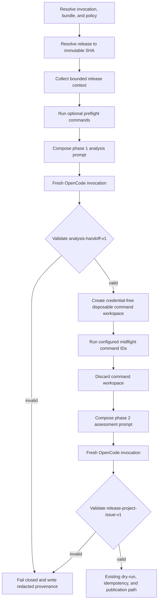

# Plan: safe `midflight_commands` for release project review

## Objective

Add a two-stage `release-project-review` interaction in which the workflow:

1. asks the agent for an initial, non-publishing assessment;
2. runs a reviewed set of workflow-owned commands;
3. gives bounded command results and the validated initial assessment to a
   fresh agent invocation; and
4. accepts a final `release-project-issue-v1` decision for the existing
   workflow-owned publication path.

`midflight_commands` must not grant shell access to the model. The model must
not choose a command, arguments, environment, working directory, credentials,
network destination, or publication target. Command selection remains part of
the hash-verified configuration bundle and command implementation remains part
of the pinned workflow revision.

## Security invariants

The implementation is acceptable only if all of these invariants hold:

- **The model requests no executable action.** The first response describes
  questions or hypotheses, but it cannot name or select a command to run.
- **Commands are capabilities, not shell text.** Bundles contain stable command
  IDs. A workflow-owned registry maps each ID to a fixed argument vector and
  execution policy. No shell, interpolation, chaining, redirects, arbitrary
  flags, or environment assignments are supported.
- **Configuration cannot broaden authority.** Only
  `release-project-review` may declare `midflight_commands`; policy and the
  command registry set the upper bound. Callers have no input for adding or
  overriding commands.
- **Target content is hostile.** A release checkout, test suite, Makefile,
  plugin, generated file, process output, and release text are all untrusted,
  even at an immutable commit.
- **Command execution is credential-free and disposable.** Commands run in an
  isolated copy of the resolved commit with provider/GitHub credentials
  removed, bounded resources, bounded output, no stdin, and network disabled
  where the runner can enforce it. The command workspace is discarded before
  either agent receives filesystem access.
- **No command mutation becomes agent authority.** Only explicitly approved,
  bounded result data and artifact checks cross the command boundary. Generated
  scripts, configuration, prompts, agents, or arbitrary files are never loaded
  by OpenCode.
- **Both model outputs are untrusted.** The first response is contract-checked,
  bounded, and inserted into the second prompt as delimited data. It is never
  appended to system instructions or executed.
- **Only the final response can publish.** The first phase has no publication
  contract. The existing deterministic runner continues to own repository,
  endpoint, token, labels, idempotency, dry-run behavior, and issue creation.
- **Failures stop closed.** Unsupported commands, isolation failures, output
  overflow, invalid handoffs, policy mismatches, or provider errors do not
  fall back to a one-stage review or skip the midflight phase silently.
- **Diagnostics do not retain evidence.** Provenance records hashes, phase
  counts, statuses, limits, and failure classes, but not raw prompts, model
  output, command output, release bodies, or credentials.

## Proposed interaction protocol

Use two independent OpenCode invocations joined by a workflow-owned handoff
artifact. Do not depend on provider conversation/session state: it is harder to
bound, reproduce, redact, and audit than explicit prompts.



### Phase 1: initial analysis

The phase-1 prompt uses the current five-section structure, but replaces the
final issue contract with an immutable, non-publishing
`release-project-analysis-handoff-v1` contract. It tells the agent to assess
the supplied release-management evidence, identify what the configured checks
could confirm or disconfirm, and summarize its current position.

Suggested exact response shape:

```json
{
  "assessment": "bounded initial release-management assessment",
  "validation_questions": ["bounded question"],
  "relevant_evidence": ["bounded evidence reference"]
}
```

The parser must enforce exact keys, string/item/count/byte limits, and reject
command-like authority fields such as `command`, `commands`, `args`, `shell`,
`environment`, `working_directory`, `url`, `repository`, `endpoint`, or
`credentials`. Free text is data only; a command name appearing in prose does
not change the configured execution plan.

If no `midflight_commands` are configured, retain the existing one-stage
behavior. If one or more are configured, both model phases are mandatory.

### Workflow-mediated command phase

After validating phase 1, run every configured command ID in declaration order.
Continue through nonzero exits and ordinary timeouts so the complete configured
check set can become evidence. Stop immediately for an execution-safety error,
such as an unknown command ID, failed isolation, unavailable mandatory runtime,
capture failure, or resource-control failure.

Return structured internal results rather than preformatted text:

- command ID and registry version;
- status: `passed`, `failed`, `timed_out`, or `safety_error`;
- exit code when available;
- bounded combined output tail plus an explicit truncation marker;
- approved artifact checks containing only path ID, presence, type, and size;
- duration bucket, not high-resolution timing; and
- a hash of the complete result metadata for provenance.

The prompt formatter converts these records to a bounded, explicitly
delimited untrusted evidence section. Command output must never be interpreted
as JSON control data, Markdown instructions, an agent file, or a prompt.

### Phase 2: reflection and final assessment

Compose a new prompt from immutable workflow sections. Include:

- the same typed release identity and bounded original context;
- preflight results, if retained;
- the validated phase-1 handoff under a separate untrusted delimiter;
- structured midflight results under a separate untrusted delimiter; and
- the existing immutable `release-project-issue-v1` suffix.

The prompt asks the agent to compare its initial assessment with the observed
results, explain material changes, and produce only the final issue decision.
The existing final parser, label allowlist, destination checks, idempotency
marker, and publication code remain authoritative.

## Configuration and compatibility design

### Manifest schema

Prefer command IDs rather than command-looking strings:

```json
{
  "schema_version": 2,
  "midflight_commands": ["documentation-build"]
}
```

Introduce schema version `2` and reject unknown manifest keys in every schema.
This avoids an older schema-1 resolver silently accepting and ignoring
`midflight_commands`. Preserve schema 1 for existing bundles, but permit the
new field only in schema 2.

Validation rules:

- field is optional and defaults to an empty list;
- only valid when `allowed_workflows` includes and the active workflow is
  `release-project-review`;
- one to three unique command IDs when present;
- declaration order is preserved;
- every ID must exist in the pinned registry and permit the `midflight` phase;
- a command may not appear in both preflight and midflight unless its registry
  definition explicitly allows repeated execution; and
- configuration resolution, including `validate_only`, rejects an invalid ID.

For consistency and safety, migrate `preflight_commands` to the same ID-based
registry in schema 2. Continue reading schema-1 command strings through a
small compatibility mapping until schema 1 is retired.

### Command registry

Add a dependency-free `scripts/agentic_commands.py` shared by configuration
validation and runtime execution. Each immutable registry entry defines:

- stable ID and registry version;
- allowed workflow and phase(s);
- fixed argv and executable lookup policy;
- timeout and output-byte ceiling;
- environment allowlist and fixed values;
- network mode;
- CPU, memory, process, open-file, and output-file limits where supported;
- approved artifact checks; and
- whether a nonzero exit is evidence or a workflow failure.

The registry must not accept bundle-provided argv, paths, limits, environment,
or artifact globs. Adding a command is a workflow-code security change that
requires code review and a new pinned workflow revision.

## Command isolation design

The current preflight implementation executes target-controlled code directly
in `release-target`, captures all output before truncating it, and does not
prevent network or workspace mutation. Do not copy that behavior into
midflight execution. Harden the shared executor first.

Required controls, in priority order:

1. **Disposable workspace:** create a clean copy/worktree from the resolved
   commit for each command or command phase. Never run in the trusted helper
   checkout or the OpenCode analysis workspace. Discard it afterward.
2. **Credential removal:** construct the environment from an allowlist. Omit
   `GITHUB_TOKEN`, `OPENROUTER_API_KEY`, Actions OIDC variables, SSH agent
   sockets, Git credential helpers, proxy credentials, and caller secrets.
   Use a disposable `HOME` with no inherited configuration.
3. **No shell and no stdin:** execute fixed argv directly with stdin attached
   to `/dev/null`; start a separate process group and terminate the full group
   on timeout.
4. **Bound output while reading:** stream stdout/stderr into a bounded spool or
   ring buffer. Do not use unbounded `capture_output=True` followed by
   truncation.
5. **Resource limits:** apply wall-clock timeout plus platform-supported CPU,
   address-space, file-size, process-count, and open-file limits. A failure to
   install required controls is a safety error, not permission to run without
   them.
6. **Network isolation:** run with network disabled when an available,
   reviewed mechanism can enforce it. Commands requiring dependency downloads
   should not be approved as midflight checks. If the hosted runner cannot
   provide enforceable isolation, initially ship only commands that inspect
   pre-existing files without executing target code, or run commands in a
   separate locked-down job/container with no secrets and an explicit threat
   model.
7. **Filesystem boundary:** expose only the disposable checkout and required
   read-only runtime files. Do not mount the caller checkout, workflow helper
   checkout, runner temp containing resolved artifacts, Docker socket, SSH
   material, or host credential directories.
8. **Artifact allowlist:** inspect only registry-declared relative paths.
   Reject symlinks, special files, containment escapes, excessive size, and
   unexpected file types. Report metadata or bounded text only when the
   registry explicitly permits content capture.
9. **Clean analysis workspace:** invoke OpenCode over a materialized workspace
   containing only the allowlisted release documents and verified agent/skill
   files, rather than the entire target checkout. This makes
   `read-release-context-only` an enforced boundary instead of a declarative
   claim.

Until these controls exist, enable no default `midflight_commands` in the
supplied profile. Land the framework disabled, validate it, and opt in a
single low-risk command only after its isolation behavior is demonstrated.

## Policy and runtime enforcement

Extend the built-in `release-project-review` policy with a workflow-command
section separate from model `shell` capability, for example:

- allowed phases: `preflight`, `midflight`;
- maximum commands per phase and total;
- allowed registry IDs;
- required isolation profile;
- total wall-clock and output ceilings; and
- maximum model phases: two.

Policy merge remains restrictive: organization or consumer overlays may
remove command IDs, lower counts/limits, or disable midflight execution, but
cannot add commands or relax isolation. The bundle list is intersected with
the effective policy and registry.

Before execution, the release runner must assert that the loaded effective
policy matches the workflow, model profile, output contract, publication mode,
command IDs, and required isolation profile. It must also assert that model
shell and delegation remain denied. `publication_allowed` must agree with
`dry_run`; do not rely solely on the CLI flag.

Move the workflow's `validate_only` checkpoint until after bundle and policy
resolution. Validation-only must verify command IDs and phase compatibility,
then stop before release API access, target checkout, command execution,
provider invocation, or publication.

## Planned implementation areas

| Area | Planned changes |
| --- | --- |
| `scripts/agentic_commands.py` | Add the immutable command registry, schema-1 compatibility aliases, structured result model, and isolation/execution helpers. |
| `scripts/agentic_configuration.py` | Support schema 2, reject unknown fields, parse/serialize `midflight_commands`, validate IDs early, and enforce workflow/count/duplicate/phase rules. |
| `scripts/agentic_policy.py` | Add restrictive workflow-command ceilings and phase authorization; include effective command policy in the policy hash. |
| `scripts/agentic_prompts.py` | Add phase-aware composition, the `release-project-analysis-handoff-v1` parser, separate untrusted delimiters, and aggregate prompt-size bounds. |
| `.opencode/policy/output-contracts.json` | Document the handoff contract as a non-publication contract while retaining `release-project-issue-v1` for phase 2. |
| `scripts/run_agentic_release_project_review.py` | Refactor preflight into the shared safe executor; add the two-phase state machine; enforce policy/mode consistency; preserve the existing final publication path. |
| `.github/workflows/opencode-release-project-review.yml` | Resolve configuration and policy before the validation-only stop; provision the reviewed isolation mechanism; never forward secrets into the command environment. |
| `scripts/agentic_provenance.py` | Record schema/registry versions, configured command-list hashes, per-phase status classes, model phase count, isolation profile, and result hashes without raw evidence. |
| `.opencode/configuration/release-project-review/bundle.json` | Upgrade to schema 2 only when the framework is ready; initially omit or leave `midflight_commands` empty, then opt in after dry-run evaluation. |
| Documentation | Update bundle, commands, configuration, security, deployment, and operations references; describe the two-stage trust boundary and rollout. |

## Test plan

### Configuration and compatibility

- Accept schema-1 bundles unchanged.
- Accept schema-2 release bundles with valid unique command IDs.
- Reject `midflight_commands` in schema 1 or another workflow.
- Reject unknown manifest keys, unknown IDs, wrong types, duplicates, excessive
  counts, disallowed phase use, and prohibited preflight/midflight overlap.
- Verify remote manifest/hash handling and serialization remain deterministic.
- Verify a schema-2 bundle cannot be silently processed by a schema-1 path.

### Command security

- Assert exact argv execution with no shell and no stdin.
- Assert child environment excludes every provider, GitHub, OIDC, SSH, proxy,
  and credential-helper variable used by the workflow.
- Verify working-directory isolation and that mutations cannot affect trusted
  helpers, `release-target`, the analysis workspace, or runner artifacts.
- Generate unbounded stdout/stderr and verify process memory/captured storage
  remain bounded during execution, with a visible truncation marker.
- Verify full process-group termination on timeout and resource-limit failure.
- Verify enforced network denial using a local listener and an external
  connection attempt; skip enabling commands on platforms where this cannot be
  reliably asserted.
- Reject symlinks, FIFOs, devices, sockets, oversized artifacts, path escapes,
  and undeclared generated files.
- Treat normal nonzero exits/timeouts as evidence and isolation/control errors
  as fail-closed workflow failures.

### Prompt and model phases

- Verify phase 1 ends only in the handoff contract and cannot publish.
- Accept a valid bounded handoff; reject malformed JSON, unknown fields,
  command/control fields, excessive items, and oversized content.
- Verify hostile release text, phase-1 text, and command output remain in
  distinct untrusted delimiters and cannot change the phase-2 contract.
- Verify two fresh OpenCode invocations occur only when midflight commands are
  configured; otherwise preserve the current single invocation.
- Verify phase 2 receives only validated handoff data and structured bounded
  command evidence, then must satisfy `release-project-issue-v1`.
- Verify total prompt bytes remain bounded across original context, preflight,
  handoff, and midflight evidence.

### Runner, policy, and publication

- Verify command IDs are fixed before phase 1 and phase-1 output cannot alter
  their order or contents.
- Verify effective policy can narrow/disable commands but never add one.
- Verify shell/delegation denial and policy/mode consistency are enforced at
  runtime, not merely reported.
- Verify phase failures produce no issue and redacted failure provenance.
- Verify `dry_run` performs both model phases and commands but no GitHub write;
  `validate_only` runs none of them.
- Re-run existing `NO_ISSUE`, `CREATE_ISSUE`, label, external-token,
  idempotency, and publication tests unchanged after the refactor.
- Add concurrency coverage or wrapper guidance so simultaneous publication
  runs cannot create duplicate issues; command/model phases do not weaken the
  existing idempotency identity.

### Workflow and documentation

- Verify no workflow input or secret can supply command text.
- Verify configuration and policy resolution run in validation-only mode while
  release access, checkout, command execution, OpenCode, and publication do
  not.
- Verify pinned actions/tools, artifact retention, and absence of raw command
  or model evidence in uploaded artifacts.
- Correct the existing bundle-reference example that names
  `python3 -m unittest -q`, which is not in the current allowlist.

## Rollout plan

1. **Land hardening with no behavior change.** Add the registry, bounded
   executor, enforced analysis workspace, policy checks, unknown-key rejection,
   and tests while preserving schema-1 preflight behavior through compatibility
   aliases.
2. **Land schema 2 and two-phase support disabled by default.** Add the handoff
   contract and state machine, but configure no supplied midflight command.
3. **Validate configuration only.** Exercise local, default, and central
   schema-2 bundle resolution and inspect policy/provenance artifacts.
4. **Dry-run one low-risk command.** Prefer a deterministic command that does
   not execute target-controlled scripts or require network/dependency
   installation. Review isolation tests, latency, bounded evidence, phase
   quality, and redaction.
5. **Canary publication.** Enable one same-repository wrapper with concurrency
   control and short artifact retention. Keep external-target midflight use
   disabled until the canary is stable.
6. **Expand deliberately.** Approve additional registry IDs only through a
   security review of their executable, target-code execution behavior,
   dependencies, network needs, artifacts, and worst-case resource use.

Rollback is configuration-first: pin the last known-good workflow/bundle SHA
or remove `midflight_commands`. Never fall back automatically to mutable refs,
an unknown schema, an unisolated executor, or a one-stage model decision after
a midflight failure.

## Acceptance criteria

The feature is complete when:

1. a reviewed schema-2 release bundle can select up to three fixed midflight
   command IDs, and no caller or model can alter their implementation;
2. the runner performs analysis → isolated commands → fresh final assessment
   with both response contracts validated;
3. target-controlled command execution receives no workflow credentials,
   cannot access trusted workspaces, has enforced resource/output boundaries,
   and has an explicit, tested network boundary;
4. only bounded, delimited result evidence reaches phase 2, and OpenCode can
   read only the materialized release context rather than the target checkout;
5. validation-only catches invalid command configuration without fetching a
   release or running code, dry-run executes the full interaction without
   publication, and publish mode retains deterministic destination and
   idempotency controls;
6. provenance can establish which reviewed commands and phases ran without
   retaining raw prompts, model responses, command output, release bodies, or
   secrets; and
7. all existing release-review security, contract, external-token,
   idempotency, workflow-verification, and documentation tests continue to
   pass.
