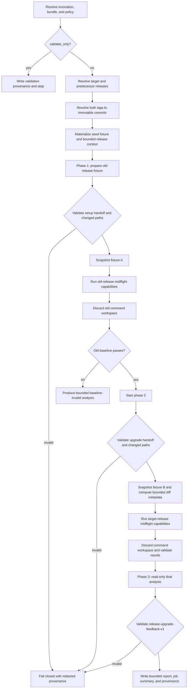

# Plan: safe `release-upgrade-feedback` workflow

## Objective

Add a reusable OpenCode workflow, `release-upgrade-feedback`, that validates a
realistic consumer upgrade from an older published release to a selected newer
published release.

The workflow will:

1. resolve a target release (an explicitly selected release, or the latest
   eligible release selected by a wrapper);
2. deterministically resolve the immediately preceding eligible release;
3. let an edit-capable but shell-denied agent prepare a bounded disposable
   consumer fixture for the older release;
4. run workflow-owned old-release validation commands through the assumed
   hardened midflight-command executor;
5. give bounded validation evidence to a fresh agent invocation, which upgrades
   only that fixture to the target release;
6. run workflow-owned target-release validation commands through the same
   executor; and
7. give the release identities, validated handoffs, bounded command evidence,
   and a workflow-computed change summary to a final read-only agent for a
   structured analysis and summary.

The initial release should produce an artifact and GitHub job summary only. It
must not create issues, comments, pull requests, releases, or commits. A later
publication feature can be designed separately after the workflow has been
validated in dry runs.

This plan assumes the capability registry, disposable execution environment,
bounded output capture, phase-aware prompt handoffs, policy ceilings, and other
controls from `docs/plans/midflight-commands-plan.md` have already been
implemented. It does not reuse the current unsafe string-based preflight
implementation in `run_agentic_release_project_review.py`.

## Scope and fixed semantics

### In scope

- One canonical GitHub repository containing both releases.
- A selected published target release and its deterministic published
  predecessor.
- A workflow-supplied seed consumer fixture copied into a disposable upgrade
  workspace.
- Agent edits restricted to an explicit allowlist inside that fixture.
- One old-release validation stage and one target-release validation stage.
- Upgrade-path findings such as missing or incorrect migration instructions,
  compatibility breaks, stale configuration, changed generated output,
  incomplete deprecation guidance, and failures to reproduce documented setup.
- A contract-validated report containing evidence, impact, required action, and
  confidence.

### Out of scope

- Modifying the target repository checkout or either release snapshot.
- Publishing model output to a repository.
- Letting a caller or model provide command text, argv, environment variables,
  paths, package coordinates, URLs, credentials, or release refs.
- Testing arbitrary release pairs in the first version.
- Inferring release order with semantic-version sorting.
- Installing dependencies from an unrestricted network.
- Giving the model shell, GitHub write, provider credentials, or direct network
  access.
- Treating a successful build as proof that an upgrade is fully compatible.

### Release selection

The reusable workflow accepts the same target shape as
`release-project-review`:

- `target_repository`: strict canonical `owner/repo` input;
- exactly one of `release_id` or `release_tag`; and
- an optional allowlisted `focus` value.

“Latest” remains wrapper behavior: a wrapper resolves `/releases/latest` (or a
bounded, explicitly documented release-list policy) and passes the numeric
release ID. The reusable workflow itself never accepts a mutable `latest`
string.

The older release is not caller-selected in version 1. The runner paginates the
GitHub releases API with strict page/item limits, filters out drafts, applies
the configured prerelease policy, orders eligible releases by
`published_at` with numeric release ID as a deterministic tie-breaker, and
selects the release immediately before the target. It fails closed if:

- the target is absent from the bounded eligible set;
- no eligible predecessor exists;
- timestamps are missing or invalid;
- the predecessor equals the target;
- the pair crosses a prohibited stable/prerelease channel boundary; or
- pagination or response bounds prevent a complete decision.

Version 1 should use stable releases only by default. An explicitly selected
prerelease is accepted only if policy enables a prerelease channel, in which
case its predecessor must also be a prerelease. Record the selection rule and
channel in provenance.

For each release, resolve `tag_name` through the Git refs API and follow
annotated tags to an immutable commit SHA. The tag commit is authoritative;
`target_commitish` is not used as the release snapshot because a branch may
have advanced since publication. A missing or unresolvable tag fails closed.

## Security invariants

The implementation is acceptable only if all of these remain true:

- **Releases are immutable inputs.** Both releases are identified by canonical
  repository, numeric release ID, tag, and tag commit SHA before any model or
  command runs.
- **The consumer fixture is the only mutable area.** Agents cannot edit either
  release checkout, trusted workflow helpers, resolved configuration, command
  definitions, prompts, policies, or provenance files.
- **Model processes have an enforced filesystem boundary.** Every OpenCode
  invocation runs in a reviewed container/sandbox with only its phase workspace
  mounted, a minimal allowlisted environment, a disposable home, no host or
  runner temporary directories, no credential stores/agents/sockets, and no
  inherited Git or proxy configuration. Post-run path validation supplements
  this boundary; it is not the boundary itself.
- **Agent edits are data, not authority.** The runner validates every changed
  path, file type, symlink state, byte count, and total patch size before a
  command can observe the fixture.
- **The model never selects the command, but fixture content remains hostile
  executable input.** Both build stages use command capability IDs fixed by the
  hash-verified bundle and bounded by built-in policy and the pinned registry.
  Because manifests, plugins, configuration, or source files can influence a
  build, the command sandbox must be strong enough to execute model-authored
  hostile content; a fixed argv is not treated as eliminating that risk.
- **Commands receive no credentials.** They run in disposable, network-denied
  workspaces with allowlisted environment variables, no stdin, bounded process
  groups/resources/output, and no access to trusted workspaces or host sockets.
- **Target content is hostile.** Release notes, source trees, package metadata,
  build scripts, generated files, command output, and earlier model output are
  untrusted even when associated with an immutable commit.
- **No generated instruction file is loaded.** Agent/skill/prompt discovery is
  limited to hash-verified configuration materialized outside the fixture.
  Generated `AGENTS.md`, `.github`, `.opencode`, prompt, skill, or policy files
  are rejected as fixture changes.
- **Each model phase has minimum authority.** Setup and upgrade agents may edit
  only the fixture and have no shell/network/delegation/GitHub access. The final
  analysis agent is read-only and sees a materialized evidence workspace, not
  an executable checkout.
- **Handoffs are explicit and validated.** Every model output is parsed against
  an exact, bounded contract and inserted into later prompts only as delimited
  untrusted data. Provider conversation state is not reused.
- **The old setup must be a valid baseline.** An ordinary old-stage failure is
  analyzed as a baseline failure and the workflow ends with a bounded
  `BASELINE_INVALID` report. Phase 2 does not run. A future remediation loop
  would require a separate contract and must rerun the old-stage command to
  establish a passing snapshot before any upgrade is attempted.
- **Infrastructure and safety failures stop closed.** Unknown capabilities,
  isolation failures, invalid edits, output-capture failures, contract errors,
  or policy mismatches abort the workflow. There is no one-stage fallback.
- **There is no repository publication authority.** The job token is used only
  for bounded release metadata and checkout reads; the model and command
  environments receive no token.
- **Evidence retention is minimized.** Provenance stores identities, hashes,
  statuses, limits, and failure classes—not raw prompts, model responses,
  command output, release bodies, fixture contents, diffs, or credentials.

## Interaction protocol

Use three independent OpenCode invocations and two workflow-mediated command
stages. Do not carry provider sessions between phases.



### Phase 1: establish the older-release setup

Create the mutable fixture from a workflow-owned, hash-verified seed template.
The prompt supplies typed identities for both releases but instructs the agent
to configure only the predecessor in this phase. Give it only bounded,
allowlisted migration/setup documents and package metadata from the predecessor
snapshot. Do not expose arbitrary source files unless a reviewed fixture type
requires them.

The agent may edit only registry-declared fixture paths, for example:

- dependency manifest and lockfile paths approved for the fixture type;
- bounded configuration files;
- bounded example source files; and
- a workflow-owned notes file containing rationale only.

The phase ends with `release-upgrade-setup-handoff-v1`, containing only a
bounded summary, claimed changed-path IDs, assumptions, and expected validation
outcomes. It cannot contain command, argv, environment, repository, endpoint,
credential, or publication fields.

After OpenCode exits, the runner independently walks the fixture and rejects:

- changes outside the allowlist;
- absolute paths, traversal, hard links, symlinks, devices, sockets, or FIFOs;
- executable bits where not explicitly allowed;
- generated agent/instruction/policy/workflow files;
- oversized files, excessive file counts, or excessive total changes; and
- modifications to the immutable seed metadata.

Snapshot the validated fixture by content hash before old-release validation.

The fixture registry, not the model, binds a repository and release to an
ecosystem package. Each reviewed entry identifies the canonical repository,
package coordinate, supported release IDs/tags and immutable artifact hashes,
seed fixture, manifest fields that may carry the version, offline dependency
inputs, and eligible command capabilities. The runner writes the exact old
coordinate into typed phase context and verifies the resulting manifest. The
agent cannot introduce or substitute a package coordinate. A release without a
matching hash-verified offline artifact/registry entry is unsupported and fails
before model execution.

### Old-release midflight validation

Run the configured old-stage capability IDs in declaration order against a
copy of fixture snapshot A. A registry entry fixes argv, runtime image/toolchain,
working directory, environment, timeout, resource limits, network mode, output
limits, and approved artifact checks. The bundle supplies IDs only.

Ordinary nonzero exits and timeouts become evidence. Safety errors abort. Return
only structured, bounded records:

- capability ID and registry version;
- fixture snapshot hash;
- status and exit code when available;
- bounded output tail with an explicit truncation marker;
- allowlisted artifact metadata/content hashes;
- duration bucket; and
- result metadata hash.

The command copy is discarded before phase 2. Command mutations never flow back
into the agent-editable fixture.

Phase 2 starts only when every mandatory old-stage capability and artifact
check passes. Otherwise a fresh read-only analysis invocation receives the
bounded old-stage evidence and must return `BASELINE_INVALID`; no target-stage
command runs. This prevents fixture repair from being conflated with migration.

### Phase 2: perform the upgrade

Use a fresh agent invocation over validated fixture snapshot A. Supply:

- typed predecessor and target identities;
- bounded, separately delimited predecessor and target setup/migration docs;
- the validated phase-1 handoff as untrusted data; and
- structured old-stage command results as untrusted evidence.

The agent upgrades the passing fixture to the target release without running
commands. The runner supplies the target package coordinate from the same
fixture registry and verifies that exact coordinate after the edit. The agent
cannot repair an invalid baseline, replace the seed fixture, introduce another
package, or request another release/command.

Validate `release-upgrade-change-handoff-v1` and enforce the same filesystem
rules. Snapshot fixture B. The runner then computes bounded machine evidence
between A and B: changed path IDs, file modes, byte counts, and content hashes.
Raw diff content is included in the final evidence only for explicitly approved
small text files and is always delimited as untrusted data.

### Target-release midflight validation

Run the configured target-stage capability IDs against a disposable copy of
fixture snapshot B with the same executor guarantees. Old- and target-stage
capabilities may share a registry implementation, but stage binding and
release-specific fixed parameters must be immutable. A model cannot cause the
old command to use the target release or vice versa.

Do not automatically declare success merely because the second build passes.
The final agent must see both stages, including an old-stage failure followed by
success, and explain what that evidence does and does not establish.

### Phase 3: final analysis

Invoke a fresh read-only agent over a context-only workspace. It receives:

- canonical identities for the release pair;
- the predecessor-selection rule;
- both validated handoffs;
- both structured command result sets;
- bounded workflow-computed fixture change evidence; and
- explicit evidence-limit/truncation indicators.

It does not receive command workspaces, release checkouts, credentials, or an
editable fixture. The immutable final suffix requires
`release-upgrade-feedback-v1`, for example:

```json
{
  "outcome": "PASS_WITH_NOTES",
  "summary": "bounded summary",
  "old_release_validation": "bounded evidence assessment",
  "upgrade_validation": "bounded evidence assessment",
  "findings": [
    {
      "severity": "medium",
      "confidence": "high",
      "evidence_ids": ["target-command:consumer-docs-build:status"],
      "evidence": "bounded evidence reference",
      "upgrade_impact": "bounded impact",
      "required_action": "bounded project-owned action"
    }
  ],
  "limitations": ["bounded limitation"]
}
```

Allow only `PASS`, `PASS_WITH_NOTES`, `FAIL`, or `BASELINE_INVALID`. Enforce exact keys, enum values,
item counts, per-field and aggregate byte limits, evidence references, and a
small severity/confidence allowlist. Evidence IDs are opaque workflow-issued
IDs and must resolve to supplied records; prose alone cannot establish
evidence. Reject destination, endpoint, command, credential,
label, assignee, milestone, patch, or tool-invocation fields. `PASS` requires no
findings; `FAIL` requires at least one high-confidence actionable finding.
`BASELINE_INVALID` is permitted only on the short-circuit path and must identify
the failed old-stage evidence IDs without making target-release claims.

The runner renders the validated structure into Markdown. The model does not
supply raw Markdown for direct publication.

## Configuration and policy design

### Bundle profile

Add `.opencode/configuration/release-upgrade-feedback/` with:

- `bundle.json` restricted to `release-upgrade-feedback`;
- a setup/upgrade agent definition with fixture-only editing and no shell,
  network, delegation, or GitHub access;
- a final read-only analysis agent (or a phase-specific immutable agent
  selection owned by the runner);
- `prompts/release-upgrade-feedback.md`;
- `skills/release-upgrade/SKILL.md`; and
- regenerated `hashes.json`.

Extend the bundle model with an immutable, hash-covered phase map rather than a
single ambiguous agent/contract pair:

| Phase | Agent authority | Required contract |
| --- | --- | --- |
| `setup-old` | fixture-edit-only | `release-upgrade-setup-handoff-v1` |
| `upgrade-target` | fixture-edit-only | `release-upgrade-change-handoff-v1` |
| `analyze-final` | context-read-only | `release-upgrade-feedback-v1` |

The manifest names each agent file and contract; configuration resolution
verifies every file hash, exact phase name, policy compatibility, and absence
of extra phases. Remote bundles cannot substitute an edit-capable agent into
the final phase or change phase order.

Target the post-midflight manifest schema. Represent command selection as
stage-bound capability IDs, not shell-looking strings. Prefer a shape such as:

```json
{
  "schema_version": 2,
  "old_release_midflight_commands": ["consumer-docs-build"],
  "target_release_midflight_commands": ["consumer-docs-build"]
}
```

If the implemented midflight schema already has a general phase-binding
structure, use that structure instead of adding aliases. In either case:

- allow one to three unique IDs per stage;
- preserve declaration order;
- validate every ID during configuration resolution;
- require registry authorization for this workflow and stage;
- reject unknown keys and cross-stage use not explicitly permitted;
- prohibit caller overrides; and
- include both ordered lists in the configuration digest.

Implementation must not start until the assumed midflight work has landed a
versioned API for phase-bound capability IDs, immutable execution policy,
disposable sandbox creation, streamed bounded results, fixture/artifact
snapshots, policy intersections, and redacted provenance metadata. Record the
exact schema and registry versions in this plan during implementation; do not
adapt silently to an unspecified interface.

The seed fixture type and editable path IDs should also be fixed by the bundle
and narrowed by policy. They must resolve through pinned registries; bundles
must not introduce filesystem globs or host paths.

### Built-in policy

Add a dedicated `release-upgrade-feedback` policy and
`release-upgrade-feedback-readonly`/phase-compatible model profile. It should
fix or bound:

- shell: `deny` for every model phase;
- delegation: `deny`;
- model network: `provider-only`;
- GitHub write: `deny`;
- filesystem: fixture-edit-only in phases 1–2 and context-read-only in phase 3;
- maximum model phases: three;
- maximum command stages: two;
- allowed capability IDs by stage;
- required executor isolation profile;
- fixture file/count/byte/change limits;
- prompt, handoff, result, and report limits;
- provider and command timeouts; and
- publication: `deny`.

Policy overlays may remove capabilities, reduce counts/limits, or disable
stages, but cannot add command IDs, paths, fixture types, model permissions, or
publication authority. The runner must assert the loaded effective policy
against the workflow, contracts, agents, stage IDs, executor profile, mode, and
publication setting before release API access or model execution.

## Workspace and data-boundary design

Use physically separate roots:

1. `workflow-helpers`: trusted pinned scripts and registries;
2. `release-old`: read-only predecessor snapshot;
3. `release-target`: read-only target snapshot;
4. `fixture-edit`: the only agent-editable workspace;
5. per-stage disposable command workspaces; and
6. `analysis-context`: final allowlisted evidence only.

Never place `.opencode` configuration inside a hostile checkout. Materialize
verified agents/skills in a runner-owned root and invoke OpenCode with explicit
phase directories inside an OS-enforced container/sandbox. Mount only the phase
workspace and required verified configuration, make configuration read-only,
drop capabilities, set a minimal environment and disposable home, and exclude
host roots, runner temp, Docker/container sockets, SSH/GPG agents, credentials,
and workflow secret files. Network access is restricted to the provider
transport through a reviewed boundary that cannot reach arbitrary destinations;
if that cannot be enforced, use a separate provider broker rather than exposing
the runner network. Before and after each invocation, also verify containment
and workspace inventory. The final analysis root must contain no executable
build scripts unless represented as inert, bounded text evidence.

Dependency availability must be deterministic. Prefer a pinned toolchain image
and pre-populated, hash-verified dependency cache or vendored fixture inputs.
Network remains disabled during command execution. If an ecosystem cannot
build without live downloads, that fixture/capability is not eligible for the
initial release; do not weaken network isolation to support it.

Annotated-tag resolution follows tag objects with cycle detection and a small
fixed maximum depth. Every object SHA and type is validated, and resolution
fails unless the terminal object is a commit.

## Planned implementation areas

| Area | Planned changes |
| --- | --- |
| `.github/workflows/opencode-release-upgrade-feedback.yml` | New manual/reusable workflow with minimal `contents: read`, pinned actions, helper checkout, configuration/policy validation before the validation-only exit, pair resolution, separate immutable release checkouts, three model phases, two midflight stages, bounded artifacts, and no repository write permission. |
| `scripts/run_agentic_release_upgrade_feedback.py` | Dedicated state machine for pair resolution, fixture snapshots, phase handoffs, changed-path enforcement, command evidence, final contract, report rendering, and redacted provenance. |
| Shared release helper module | Extract canonical repository checks, bounded GitHub requests, release/tag resolution, and redaction from `run_agentic_release_project_review.py` so both runners use one reviewed implementation. |
| `scripts/resolve_invocation.py` | Register the workflow; reuse strict target release fields; add workflow-specific focus and compatibility rules; serialize typed fields consistently. |
| `scripts/agentic_configuration.py` | Register workflow/profile/contracts and validate the post-midflight stage bindings, fixture type, and editable path IDs. |
| Post-midflight command registry | Add reviewed capability authorization for both upgrade stages, fixed toolchain/runtime behavior, artifact checks, and stage-specific parameter binding. |
| `scripts/agentic_policy.py` | Add phase-specific least-privilege model policy, command-stage ceilings, fixture limits, and publication denial. |
| `scripts/agentic_prompts.py` | Add typed pair context, separate untrusted evidence sections, two handoff parsers, final report parser, and aggregate bounds. |
| `.opencode/policy/output-contracts.json` | Register the setup handoff, change handoff, and final feedback contracts; only the final contract is user-facing. |
| `scripts/agentic_provenance.py` | Add pair identity and snapshot/result hashes, phase/status metadata, selection rule, channel, and failure classes without raw evidence. |
| `.opencode/configuration/release-upgrade-feedback/` | Add the supplied profile, agents, prompt, skill, bundle, seed-fixture reference, and hashes. |
| `verify-reusable-workflows.yml` | Verify the reusable workflow, profile, contracts, policy mappings, pinned actions, examples, and validation smoke call. |
| `docs/examples/configuration-sources/*` | Add default/local/central wrappers for latest and explicit target releases; begin with `validate_only: true`. |
| Documentation | Update README, configuration/bundle references, command docs, security model, deployment guide, and operations guide. |

## Modes and outputs

### `validate_only`

Resolve and verify invocation, bundle hashes, agents, contracts, policy,
capability IDs, fixture registry entries, and phase compatibility. Then stop
before GitHub release access, checkout, model invocation, commands, or report
generation. Emit redacted validation provenance.

### `dry_run`

Run the complete pair resolution, setup, both command stages, upgrade, and final
analysis. Write the validated rendered report as a short-retention preview
artifact, but omit the report body from the GitHub job summary. This is the
evaluation/canary mode.

### normal run

Run the same pipeline, upload the validated report plus redacted provenance,
and render the bounded report in the GitHub job summary. No GitHub write
endpoint is called. Artifact names must not include untrusted release names or
tags; use numeric IDs and bounded hashes.

## Test plan

### Release pair resolution

- Accept release ID or conservative tag for the target; reject both/neither.
- Reject malformed repositories, URLs, ref syntax, traversal, and invalid focus.
- Resolve both release tags to immutable commits, including annotated tags.
- Reject annotated-tag cycles, excessive tag depth, and non-commit terminals.
- Prove a branch advancing after publication cannot change either snapshot.
- Reject drafts and enforce stable/prerelease channel rules.
- Select the immediate predecessor deterministically across pagination.
- Test timestamp ties, deleted gaps, missing timestamps, no predecessor,
  duplicate IDs/tags, API truncation, excessive pages, and target not found.
- Bind every API response to the canonical repository returned by GitHub.
- Require an explicitly forwarded read-only target token for external targets.

### Configuration and policy

- Resolve supplied/default/local/central profiles and deterministic hashes.
- Reject workflow/profile/contract mismatches and unknown manifest keys.
- Reject unknown or wrong-stage capability IDs, duplicates, excessive counts,
  caller overrides, arbitrary paths, and fixture types absent from the registry.
- Verify overlays can narrow but never broaden commands, edit paths, limits,
  network, shell, delegation, GitHub access, or publication.
- Verify runner-time policy assertions fail before release/model/command access.

### Agent workspace and edit enforcement

- Verify setup/upgrade agents can edit only declared regular files in the
  disposable fixture.
- Verify OS-level model sandboxes cannot read host roots, helper/checkout/temp
  trees, secret files, sockets, inherited configuration, or non-phase mounts.
- Reject symlinks, hard-link escapes, path traversal, case-collision paths,
  special files, executable-bit changes, oversized patches, and generated
  `.opencode`, `AGENTS.md`, workflow, prompt, policy, or credential files.
- Verify neither release checkout nor trusted helper tree changes.
- Verify generated command files never flow back to `fixture-edit`.
- Verify the final agent has read-only context and cannot see arbitrary fixture,
  checkout, runner-temp, or secret files.

### Midflight stages

- Assert exact registry argv with no shell/stdin and fixed stage/release binding.
- Assert credential/proxy/OIDC/SSH/Git variables are absent.
- Verify disposable workspace isolation, network denial, resource limits,
  bounded streaming output, process-group termination, and cleanup.
- Treat ordinary failure/timeout as evidence and safety/control failure as a
  workflow failure.
- Verify artifact checks reject symlinks, special files, escapes, and excessive
  content.
- Verify phase outputs cannot add, reorder, remove, or parameterize commands.
- Verify exactly two command stages occur in the intended state transitions.

### Prompts and contracts

- Preserve typed identities for both releases and the predecessor rule.
- Keep release text, handoffs, command results, and diffs in distinct untrusted
  delimiters with the immutable contract last.
- Reject malformed JSON, unknown/control/publication fields, excessive data,
  unsupported outcomes/severities, and findings without evidence.
- Verify fresh provider invocations and no conversation-state dependence.
- Verify a phase-1 response cannot publish or directly authorize phase 2.
- Verify aggregate prompt limits and explicit truncation/omission indicators.
- Verify final Markdown is deterministically rendered from validated fields.

### Runner, artifacts, and provenance

- Cover successful PASS, PASS_WITH_NOTES, FAIL, and BASELINE_INVALID paths.
- Verify any mandatory old-stage failure or timeout short-circuits to
  BASELINE_INVALID with no upgrade or target command; cover target-stage
  failure and timeout combinations after a passing baseline.
- Verify no one-stage fallback after any phase or safety failure.
- Verify `validate_only` runs no API/model/command work.
- Verify `dry_run` and normal mode make no GitHub writes.
- Verify artifacts have explicit short retention and contain no raw tokens,
  prompts, release bodies, unrestricted command output, or unvalidated model
  output.
- Verify provenance/idempotency identity changes with either release ID, either
  commit, configuration digest, capability-list hash, fixture seed hash, or
  workflow version.
- Verify concurrent wrapper runs use a concurrency key based on canonical
  repository and target release ID, without embedding untrusted text.

### Workflow and documentation

- Parse YAML and require all actions to be full-SHA pinned.
- Verify minimal `contents: read` and absence of issue/PR/content write scopes.
- Verify helper checkout uses the pinned reusable workflow revision and target
  checkouts use immutable SHAs with `persist-credentials: false`.
- Verify no workflow input accepts command text, paths, prompt text, refs, or
  arbitrary release-pair selectors.
- Verify validation-only ordering, artifact paths/retention, and external-token
  declaration.
- Verify default/local/central wrappers use full SHA pins and start in
  `validate_only` mode.

## Rollout plan

1. **Land contracts and policy disabled.** Register the workflow, contracts,
   policy, fixture registry, and tests without an enabled command capability.
2. **Land the runner and reusable workflow in validation-only mode.** Exercise
   local/default/central resolution and inspect redacted provenance.
3. **Enable one deterministic fixture and command pair.** Choose a fixture that
   builds entirely from pinned local inputs with network disabled.
4. **Dry-run historical release pairs.** Use same-repository stable releases;
   inspect bounded reports, false positives, truncation, runtime, and cleanup.
5. **Canary normal artifact generation.** Keep repository publication disabled,
   use short artifact retention, and add wrapper concurrency.
6. **Enable approved external repositories.** Require a separately scoped
   read-only token and repeat canonical-binding/isolation tests.
7. **Expand deliberately.** Every new ecosystem, fixture, editable path, or
   command capability requires a security review and pinned registry change.

Rollback is configuration-first: remove the stage capability IDs or pin the
last known-good workflow/configuration SHA. Never fall back to mutable refs,
an older schema that ignores fields, live dependency downloads, an unisolated
executor, a broader edit root, or a reduced number of validation phases.

## Acceptance criteria

The feature is complete when:

1. a target published release and its deterministic predecessor are resolved to
   canonical numeric IDs and immutable tag commits before model execution;
2. phase 1 can prepare only an allowlisted disposable old-release fixture,
   workflow-owned commands validate its snapshot, phase 2 upgrades only that
   fixture, and a second command stage validates the new snapshot;
3. all command execution is capability-based, credential-free, disposable,
   network-denied, resource/output bounded, and unable to mutate trusted or
   agent-visible state;
4. a successful upgrade path uses three fresh model invocations with exact
  bounded contracts; a baseline-invalid path uses setup plus a fresh read-only
  analysis invocation, and only validated delimited evidence crosses either
  path's phase boundaries;
5. the final read-only agent receives both release identities, both command
   result sets, and bounded change evidence, then produces a valid
   `release-upgrade-feedback-v1` report;
6. no model or command can select a release, command, argument, path, endpoint,
   credential, or publication target;
7. validation-only performs complete static configuration/policy checks without
   release access or execution, and normal/dry-run modes perform no repository
   writes;
8. provenance establishes the release pair, fixture snapshots, command/result
   hashes, phase statuses, and policy/configuration versions without retaining
   raw sensitive evidence; and
9. all existing release-review, configuration, policy, provenance, workflow
   verification, and OpenCode integration tests continue to pass.
